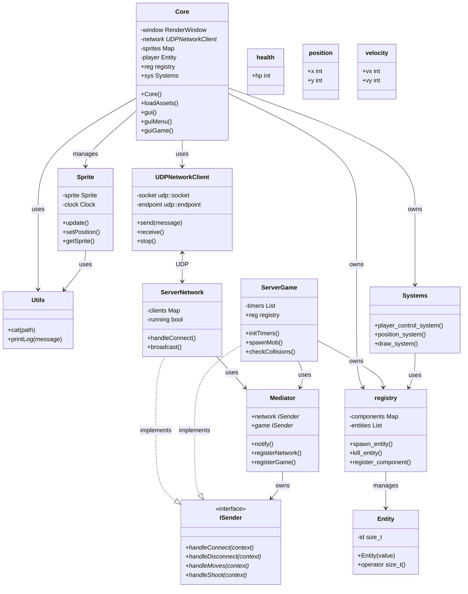

# Architecture R-Type

## Diagramme de Classes

## Description de l'Architecture

### Client
- **Core** : Classe principale gérant l'interface utilisateur et la logique client
- **UDPNetworkClient** : Gestion de la communication réseau
- **Sprite** : Gestion des éléments graphiques
- **Utils** : Fonctions utilitaires communes

### Serveur
- **ISender** : Interface pour la communication
- **ServerNetwork** : Gestion des connexions et messages réseau
- **ServerGame** : Logique de jeu et gestion des timers
- **Mediator** : Coordination de la communication

### ECS (Entity Component System)
- **Entity** : Identifiant unique pour chaque élément du jeu
- **registry** : Gestionnaire des entités et composants
- **Systems** : Logique de mise à jour des entités
- **Components** : Composants définissant les propriétés (health, position, velocity)

### Relations Principales
- Communication Client-Serveur via UDP
- ServerNetwork et ServerGame implémentent ISender
- Core utilise registry et Systems pour la logique de jeu
- Mediator coordonne la communication entre Network et Game